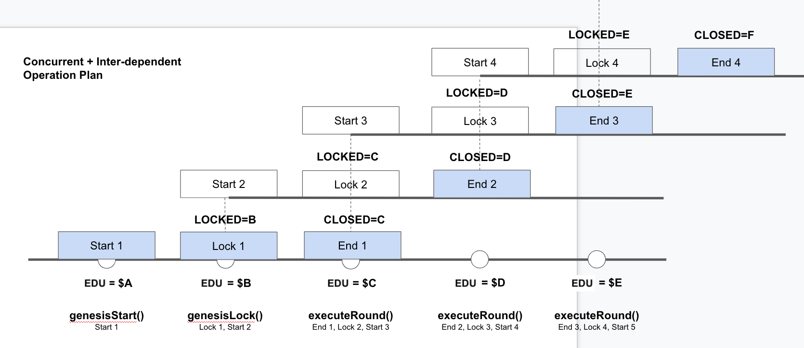
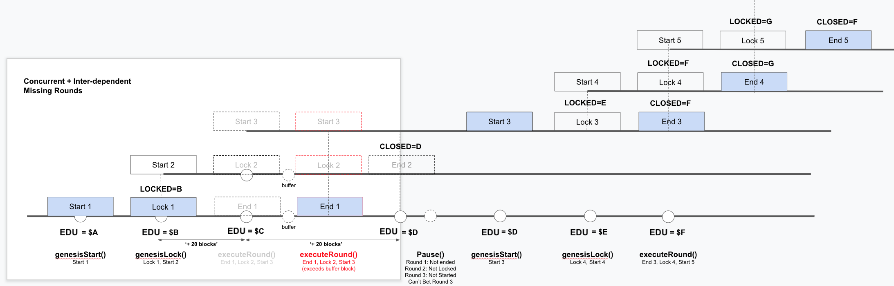

# SailFish Prediction With V3 Price Oracle

## Description

SailFish Prediction with V3 Oracle

## Documentation

### EDU/USDC

- Oracle EDU/USDC Miannet: 0xb80a2820eD522878504D9B46245D1112b2eFf3D9
- Prediction Mainnet: 0x78F948BeC290213b96BE65F0CCfc54d6A45C2047

## Deployment

Verify that `config.js` has the correct information
Uncomment private key usage lines in `hardhat.config.js`

```
export PK=PRIVATE_KEY
yarn migrate:[network]
```

### Operation

When a round is started, the round's `lockBlock` and `closeBlock` would be set.

`lockBlock` = current block + `intervalBlocks`

`closeBlock` = current block + (`intervalBlocks` * 2)

## Kick-start Rounds

The rounds are always kick-started with:

```
startGenesisRound()
(wait for x blocks)
lockGenesisRound()
(wait for x blocks)
executeRound()
```

## Continue Running Rounds

```
executeRound()
(wait for x blocks)
executeRound()
(wait for x blocks)
```

## Resuming Rounds

After errors like missing `executeRound()` etc.

```
pause()
(Users can't bet, but still is able to withdraw)
unpause()
startGenesisRound()
(wait for x blocks)
lockGenesisRound()
(wait for x blocks)
executeRound()
```

## Common Errors

Refer to `test/prediction.test.js`

## Architecture Illustration

### Normal Operation



### Missing Round Operation


